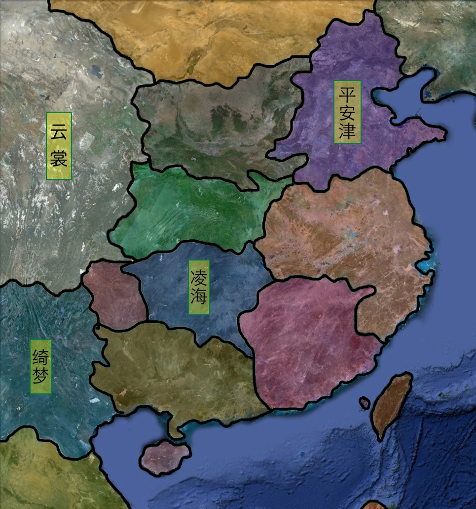

# 云裳之国  
`开发代号：YS`

## 时代设定
龙飞凤舞三年。大地之上一片歌舞升平，然而危险却悄然降临。

这是一个平静的时代，不温不火，没有惊涛骇浪；这是一个狂躁的时代，声色犬马，不乏一掷千金。

生活在这个时代的人们每天都在为了生计而忙碌。这个时代没有爱情，没有亲情，没有友情。夫妻之间没有信任，母子之间充满猜疑，亲人形同陌路，友人不过是利益的结合。这是一个礼崩乐坏的年代，这是一个充满了肮脏罪恶的年代。这个时代没有色彩，这是一个灰色的时代。
<!--时代设定-->

## 云裳之国
传说中**云裳之国**是一个没有猜疑，没有仇恨，没有妥协，没有诱惑，没有烦恼的国度。它是当年盘古开天辟地之时留下的唯一一个天与地的交集。这里是时空的终点，没有生命，也没有烦恼，人世间一切丑陋与罪恶，在这里都不存在。

当然，这里也没有人世间任何一种快乐。这里不是一个生活的地方，每个在这里的人都只有一种生存状态--停止。他们没有思想，没有喜怒哀乐。

是的，云裳之国是逃避的地方。当你厌倦了所有认识的丑恶，这里就是你的归宿。但是，当你决定放弃丑陋的时候，你也放弃了追求幸福的权利。

或许，这就是生活。
<!--云裳之国-->

## 主要地点

### 绮梦之国
位于云裳之国南麓的国度。这里是动植物的天堂，四季如春。

#### 齐云镇：
传说中最接近天堂的城镇。
#### 雾海镇：
一年中有9个月要被雾海所隐秘的地方。
#### 玄龙寺：
镇压着一条万年玄龙。玄龙出，则四海不平。
<!--绮梦之国-->

### 平安津
**玄武之国**第一大省，国都**平安京**所在地。这里是大陆最繁华的地方，是魔法文明与科技文明的结合。

#### 平安京
玄武之国国都。四季分明。
<!--平安津-->

<!--主要地点-->
## 世界地图

<!--世界地图-->